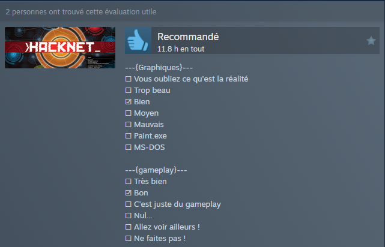

#### Hosted with ❤ by Github over here: https://vojtastruhar.github.io/steam-review-template/

# Steam Review Template

This is a tool to simplify the creation of copy-pasta reviews that are somewhat popular on Steam. The categories and options are not from my head, I just copied them from somewhere. There are some minor variations on some of the options, but this is the typical rundown.


## Usage

You just tick all the boxes that you want, the output should look something like this:

```
---{ PC Requirements }---
☐ Check if you can run paint
☐ Potato
☐ Decent
☐ Fast
☑ Rich boi
☐ Ask NASA if they have a spare computer
```

It will generate with a line on the bottom that gives me credit. I would appreciate it if you left it there, but you don't have to :)

#- Version française

#### Hébergé avec ❤ par Github ici : https://vojtastruhar.github.io/steam-review-template/

# Modèle d'avis Steam

Ceci est un outil pour simplifier la création d'avis "copy-pasta" qui sont assez populaires sur Steam. Les catégories et options ne viennent pas de ma tête, je les ai juste copiées de quelque part. Il y a quelques variations mineures sur certaines des options, mais voici le résumé typique.



## Utilisation

Il vous suffit de cocher toutes les cases que vous souhaitez, la sortie devrait ressembler à quelque chose comme ceci :

---{ Graphismes }---
☑ Vous aller oublier ce qu'est la réalité
☐ Magnifique
☐ Bien
☐ Décent
☐ Mauvais
☐ Ne le regardez pas trop
☐ MS-DOS